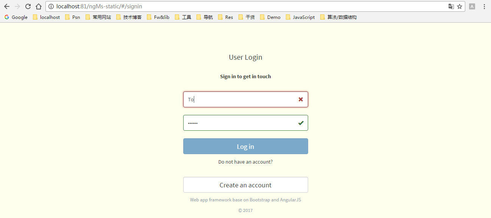
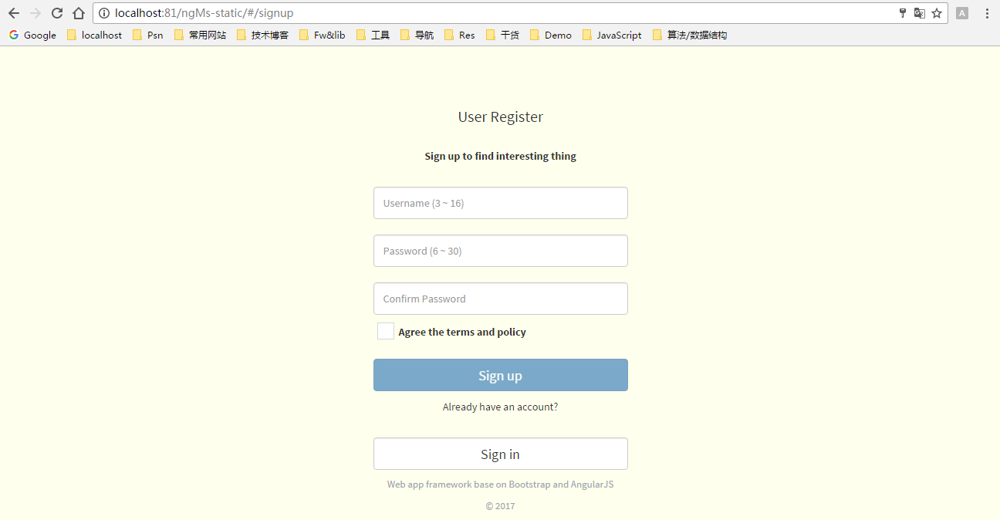
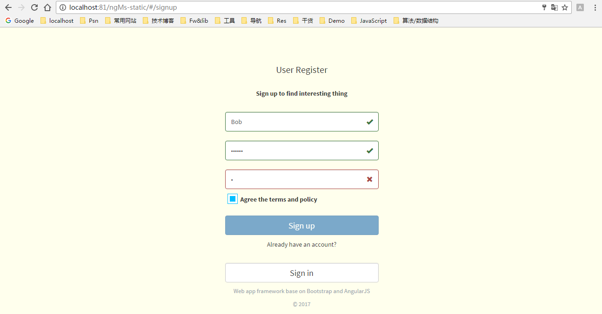
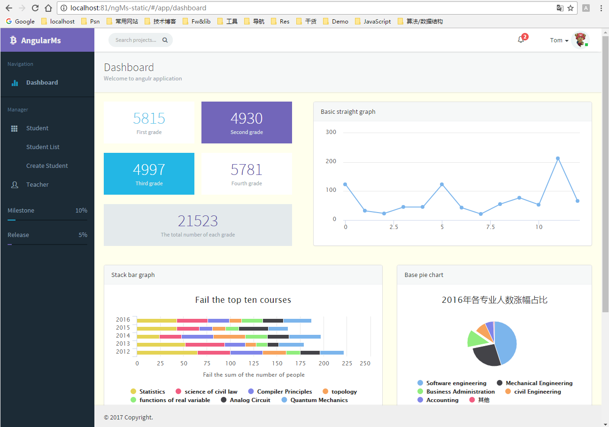
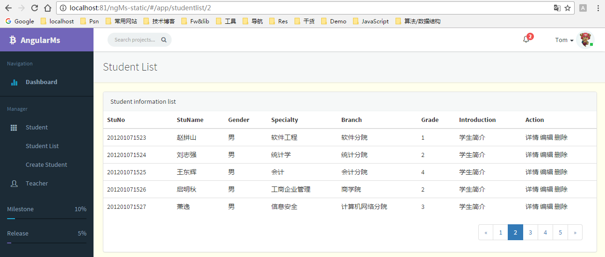
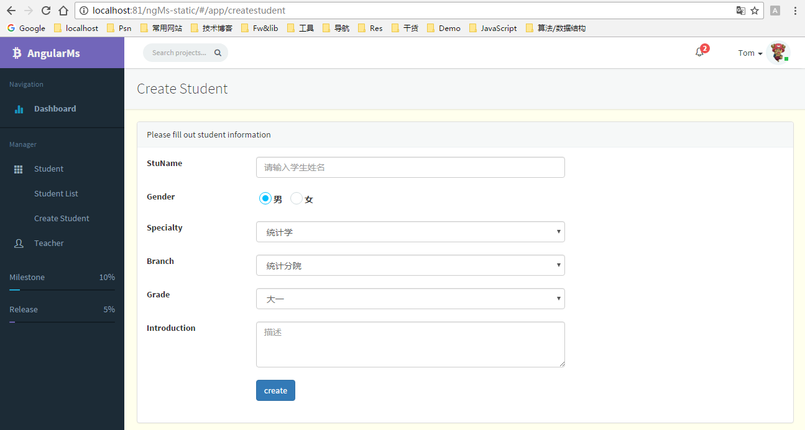
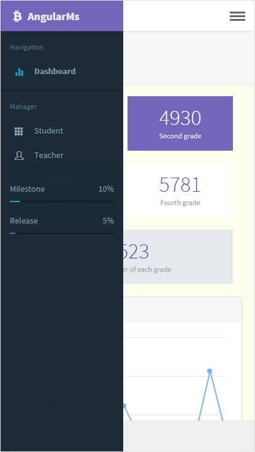

# Angular-MS
基于angular实现，后台管理系统，目前有登录、注册、图标、信息列表、添加、详情页。

### 构建
```
# 安装
npm install

# 发布 (需配置发布路径)
fis3 release
```
### *fis-conf.js*
``` javascript
// 配置发布后的默认文件夹路径
fis.match('*', {
    // deploy阶段使用local-deliver插件
    deploy: fis.plugin('local-deliver', {
        // 指定发布的路径
        // 当前设置为支持php的服务器路径下
        to: 'D:/Program Files/ApacheServer/htdocs/ng-ms-demo'
    })
});
```
## 预览

#### 登录页
    用户登录使用静态数据，内置两个账户：
        username: Tom,      password: 123456
        username: Lindy,    password: 123456



#### 注册页
    注册是写入到cookie中，未设置超时时间，关闭浏览器后自动过期。



#### 图表页
    使用highcharts图表库，绘制直线、堆叠条形、圆饼图等。


#### 列表页
    信息列表，实现了分页功能。


#### 创建页
    学生表单信息创建。


#### 响应式页
    媒体查询配合BootStrap响应式工具类实现。


### 技术栈
<pre>
angular1.x
angular-ui-router
bootstrap
jquery
highcharts
less
fis3
</pre>
